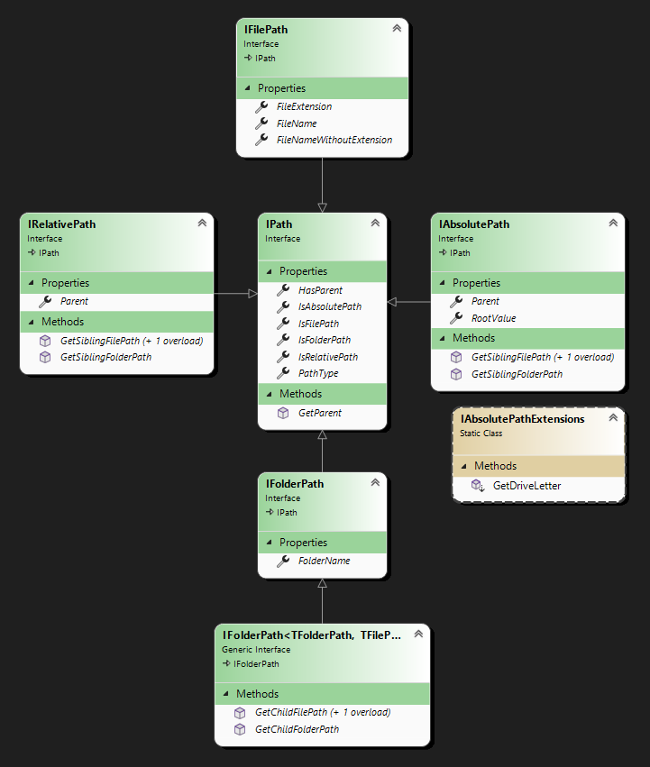
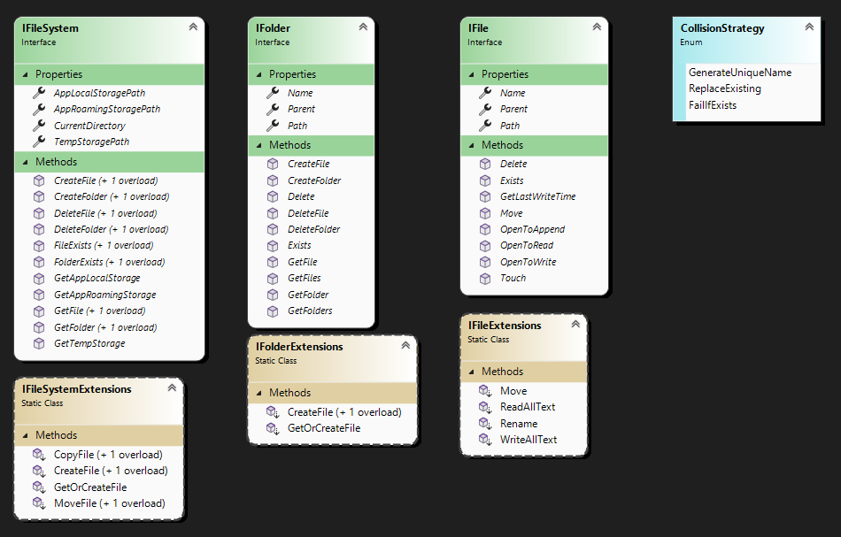

# SmartPaths

A library for dealing with paths as strongly typed objects instead of strings. <br />
Also included are abstraction for IFile, IFolder, and IFileSystem. <br />
FileSystem implementations include physical disks as well as in memory RAM drives.

## How are paths handled in SmartPaths?

Paths can be easily constructed via implicit conversion from string:

```C#
AbsoluteFolderPath absoluteFolder = @"C:\Users\Default\";
AbsoluteFilePath absoluteFile = @"C:\Windows\notepad.exe";

RelativeFolderPath relativeFolder = @"..\..\Users\Default\";
RelativeFilePath relativeFile = @"..\..\Windows\notepad.exe";
```

Absolute and relative paths can be combined in various ways:

```C#
AbsoluteFilePath combinedFile = absoluteFolder + relativeFile; 
AbsoluteFilePath combinedFile2 = absoluteFolder / relativeFile; 
// these both result in @"C:\Windows\notepad.exe"

RelativeFilePath relative = absoluteFolder >> absoluteFile;
// this results in @"..\..\Windows\notepad.exe"
```

## How are Paths modeled in SmartPaths

The core path abstractions are illustrated in the following diagram:



The implementation of the abstractions are illustrated in the following diagram:


## How are Files and Folders handled in SmartPaths?

TODO

## How are Files and Folders modeled in SmartPaths?

The storage abstractions are illustrated in the following diagram:

